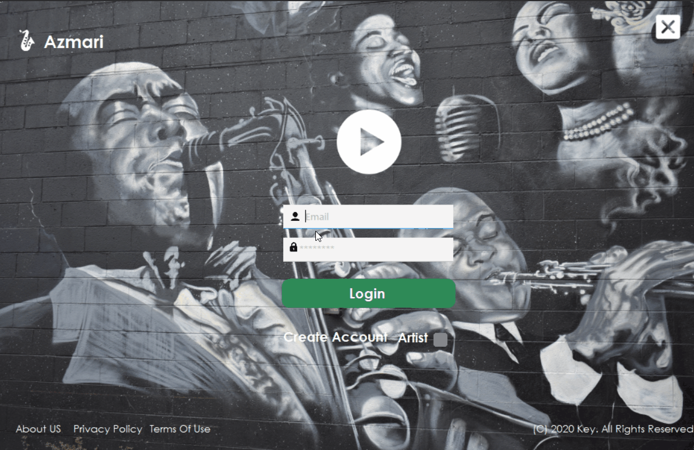

# AZMARI

AMARI is a music player program that lets users post music and listen to music made by others.



## Getting Started

These instructions will get you a copy of the project up and running on your local machine.

### Prerequisites

- [.NET Framework](https://dotnet.microsoft.com/download/dotnet-framework)
- [IDE (Preferably Visual Studio)](https://visualstudio.microsoft.com/)
- [Microsoft SQL Server](https://www.microsoft.com/en-us/sql-server/sql-server-downloads)

## Usage

1. Clone the repository
1. Create a SQL server database named AZMARI, and the tables/stored procedures/functions by executing the queries found in
   `./Sql/AZMARI_tables.sql` and `./Sql/AZMARI_functions&storedprocedures.sql`
1. Start Visual Studio.
1. On the menu bar, choose File -> Open -> Project.
1. Specify location of the project.
1. Modify the **uid** and **pwd** values found in `./Azmari/Azmari/DBService.cs` to the username and password of your SQL Server
1. Click the Run button or press F5 key to execute the project.

### Modifying the uid and pwd values

```c#
namespace Azmari
{
    class DBService
    {
        string conStr = "server=.;database=AZMARI;uid=username;pwd=password;pooling=true; connection lifetime=120; max pool size=500";
```

## Authors

- **Liul Alemayehu** - _Initial work_

## License

This project is licensed under the [MIT](https://choosealicense.com/licenses/mit/) License
